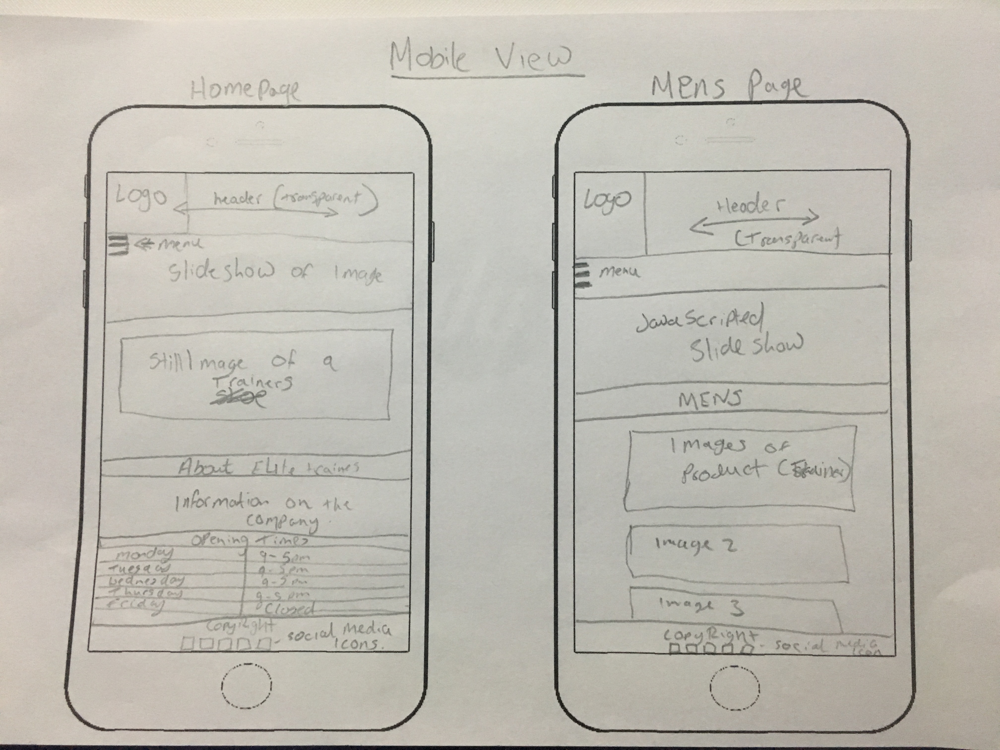
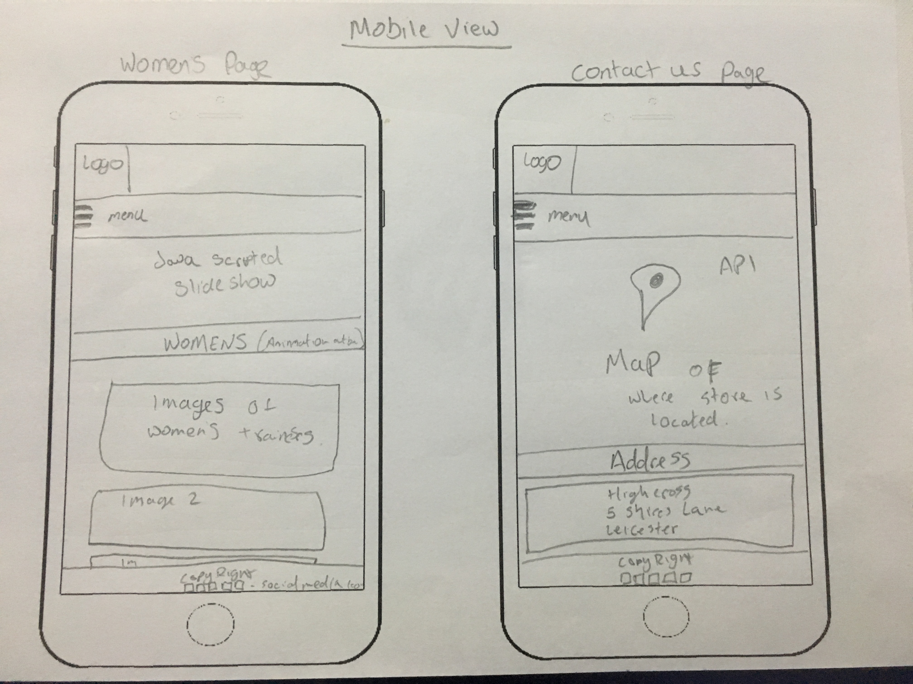
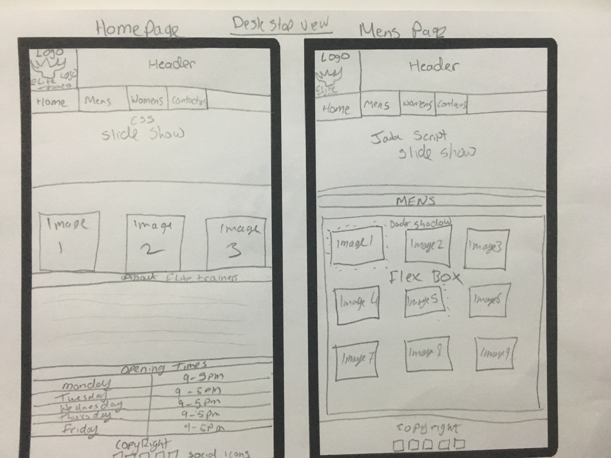
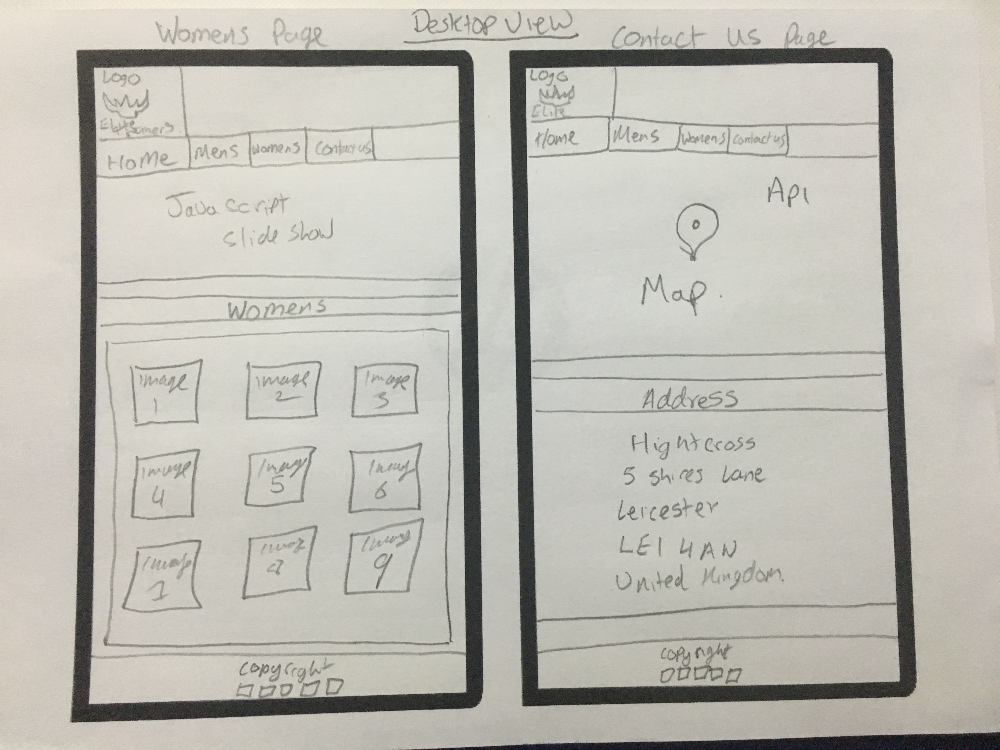

<h1> **What did not go well and what I learnt** </h1>

1. Trying to place the social media icons in the footer was tricky, every time the size of the website changed the social media icon was all over the place however by visiting official websites online and seeing how their code was placed enhanced my learning to code as for my website I only needed to code the icons coding inside the "footer" element to place the social media sites in the footer.

2. Coding on JavaScript was difficult as I had errors with my syntax therefore by visiting the development console and checking what the error was and where it was had resolved the issue.
This was something I learnt while coding as when running the websites, if there is an error by visiting the developer’s tool and seeing an error which allowed me to resolve the issue.

3. After adding breakpoint (media query) to make my website to be responsive for users to use the website on mobile, tablets and desktop coding to resize the images contain inside the box was tricky and everything resized and the images didn’t.
The issues were not resolved however the websites is still responsive for users use.

4. Making the slides for JavaScript was not a problem, however when it came to being responsive I was unable to find what codes was needed to change its size so it can be responsive for mobile use.
Was unable to resolve the issue and is left to default size for large screens.
5. While creating the website I have learnt how to make a website responsive for mobile use and the reason why mobile first design is required due to fact majority of the people would gain access to the website through their mobile then desktop size screens.
Also, it has increase my ability to learn more of CSS and JavaScript, I have also learnt to add transitions & animation to website by coding.
finally, one of the most important aspect was learn is to structure the codes which was a huge benefit for me was I was aware of what the codes was used for and I could find the codes quickly I needed to make changes to a certain aspect to the website.

<h1> Screen Designs </h1/>

Tablet view is exactly the same as mobile view however as screen get bigger the content inside adjusts it layout to fit with the tablet size.

<h1>Reference</h1>
https://www.w3schools.com/css/css3_flexbox.asp "Used flexbox to preview all the products (trainers) on mens and womens page this, some of the codes were used from this websites onto mywebsite"
https://xopixel.com/responsive-animated-image-grid-html5-css3/ "adapted this code for grides layout on my website and changing certain codes e.g. sizes and layouts to fit with my website "
https://developers.google.com/maps/documentation/javascript/get-api-key " key that was needed to make my api to work which had to be generated from the google website"

https://www.youtube.com/watch?v=9CY0V0JAgNU "This is the tutorial I have used to create contact us page and to add maps"